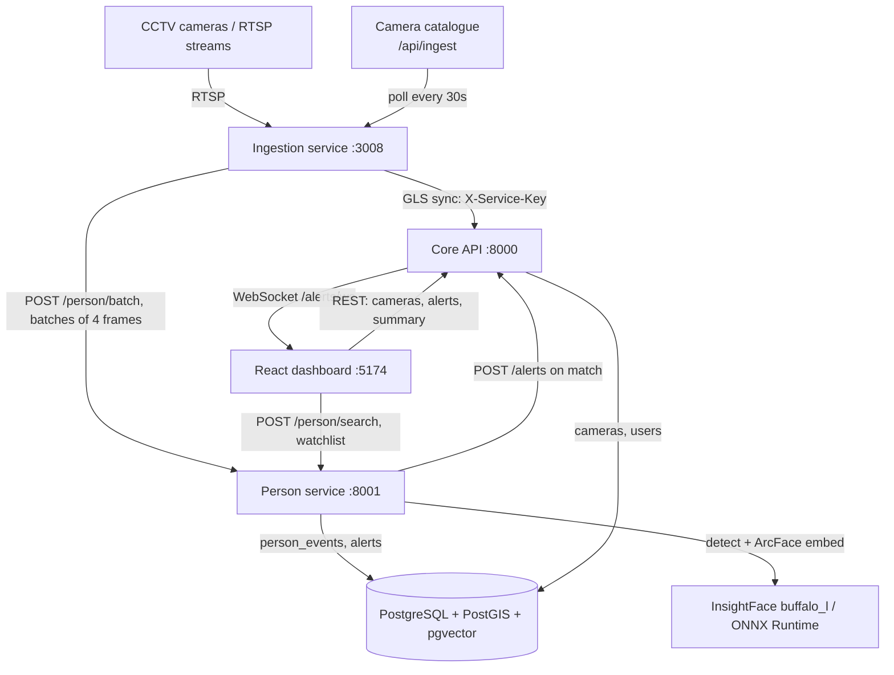

# Architecture

## System Architecture

Netra is a set of loosely coupled services that communicate over HTTP and WebSocket and share one PostgreSQL database (with the PostGIS and pgvector extensions).



## Components

| Component | Technology | Responsibility |
|---|---|---|
| Ingestion | Python, FastAPI, OpenCV | Polls the camera catalogue, runs one RTSP worker per online camera, samples ~5 fps, buffers, batches, JPEG-encodes once and dispatches to the AI services. Syncs camera metadata to Core. |
| Person service | Python, FastAPI, InsightFace, ONNX Runtime | Receives batches (`202`), detects faces, computes 512-dim embeddings, stores every sighting, matches watchlists, raises alerts, serves photo search and watchlist management, runs retention cleanup. |
| Core API | Python, FastAPI, SQLAlchemy | Camera registry (CRUD, CSV/JSON bulk import, export, gap analysis), admin summary, alert WebSocket broadcast, alert and event queries. |
| Frontend | React 18, TypeScript, Vite, Leaflet | Dashboard, camera map, live alert toasts and feed, photo search with timeline and trail map. |
| Database | PostgreSQL 15, PostGIS, pgvector | Cameras, users, watchlists, person events and alerts. Vector similarity search over 512-dim embeddings. |
| Infrastructure | Docker Compose | Runs the database image (pgvector + PostGIS). |
| CI | GitHub Actions | Submission completeness validation (`validate.yml`). |
| Development | IBM Bob | TODO — state how Bob was used, once confirmed. |

## Data Flow

1. Ingestion polls `GET /api/ingest` (catalogue) and gets the list of live cameras with their RTSP URLs.
2. It pushes the camera metadata to Core at `POST /cameras/gls-sync` (authenticated with `X-Service-Key`), which fills the camera registry that the dashboard and the database foreign keys rely on.
3. For each online camera, a stream worker decodes frames. The sampler keeps about 5 fps, and the buffer manager holds at most 30 frames per camera.
4. The batcher groups 4 frames (or flushes after 1 s) and the encoder JPEG-encodes them once at quality 85. The payload builder base64-encodes them into the JSON shape below.
5. The dispatcher posts each batch to `POST /person/batch`. The Person service decodes it, queues the frames and returns `202` at once.
6. A background worker runs `process_frame()`, which detects faces and returns bounding boxes, 512-dim embeddings and crops.
7. Every detection is written to `person_events`. Crops are saved to disk.
8. The worker loads the combined missing + wanted watchlist and runs `match_watchlist()` (cosine distance, threshold 0.4). On a match that is not in cooldown, it writes `person_alerts` and posts to Core `POST /alerts`.
9. Core broadcasts the alert to all connected dashboards over `WS /alerts/ws`.
10. For search, the dashboard sends a photo to `POST /person/search`. The service embeds it and runs a pgvector nearest-neighbour query over `person_events`, and returns sightings with camera and time.
11. Every hour-scale cycle, the retention job deletes unmatched `person_events` older than 48 h and their crop files.

Payload from Ingestion to the Person service:

```json
{
  "frames": [
    {
      "camera_id": "CAM-001",
      "organization_id": "ORG-POLICE",
      "pts_ms": 123456.0,
      "width": 1920,
      "height": 1080,
      "format": "jpeg",
      "frame": "<base64 JPEG>"
    }
  ]
}
```

## Main Database Tables

| Table | Purpose |
|---|---|
| `cameras` | Registry: location (lat/long), status, department, district, stream URLs |
| `users` | Operator accounts (department, role) |
| `person_missing` / `person_wanted` | Watchlists with a 512-dim `reference_embedding` and reference photo |
| `person_events` | Every detection: camera, timestamp, bbox, embedding, crop path, optional watchlist match |
| `person_alerts` | Alerts raised on watchlist matches, with category, camera, similarity and status |

## Security Considerations

- **Service-to-service auth:** camera sync into Core requires the `X-Service-Key` header, and the key is read from environment variables.
- **Secrets:** all configuration comes from `.env` files, and `.env` is git-ignored. Only `.env.example` files with dummy values are committed.
- **Data minimisation:** unmatched detections and their face crops are deleted automatically after 48 hours.
- **Known gaps (prototype):** CORS is open (`*`), there is no operator login or role enforcement yet, and the default service key and database credentials are demo values that must be changed for any real deployment.

## Scalability Notes

- Services are stateless apart from the database, so the Person service can run as multiple workers behind a load balancer, and ingestion can be sharded by camera group.
- Inference is the bottleneck. `onnxruntime-gpu` can replace the CPU runtime with no code change, and batching (already in place) improves GPU throughput.
- Bounded queues and drop-on-full behaviour keep memory flat under load. A message broker (Kafka or RabbitMQ) between ingestion and the Person service would add durability if dropped batches become unacceptable.
- pgvector supports HNSW/IVFFlat indexes, which keep nearest-neighbour search fast as `person_events` grows.